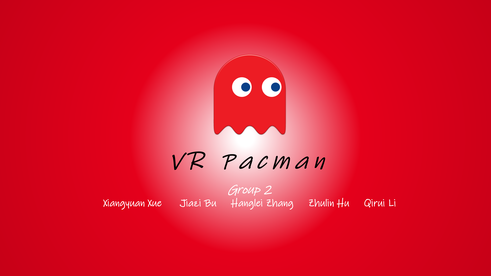
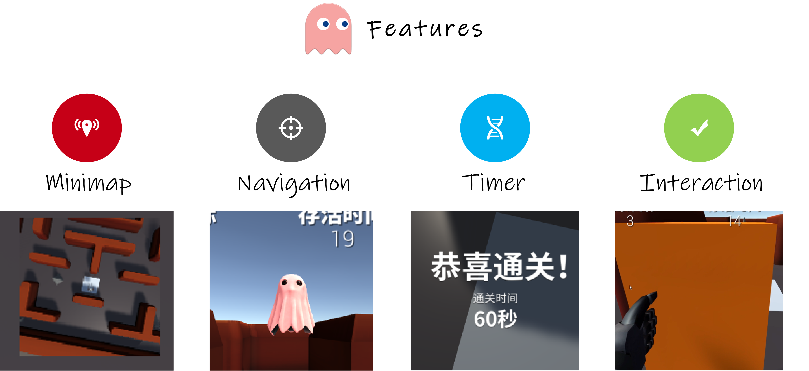

# VR-Pacman
This is the official implementation of the AI3608 Spring Project **VR Pacman**. The project is completed by Group 2.

    

## 📚 Introduction

This project is a VR version of the Pacman game. The player need to transport a certain number of objects to designated locations within a maze while avoiding capture by ghosts. Please note that if players are captured by ghosts or move outside the boundaries of the maze, the game will end in failure.

## 📺 Game Features

- A top-down mini-map located in the upper right corner that follows the player.
- Implement ghost navigation to automatically pathfind through the maze and capture the player.
- A timer that records the player's survival time.
- Player interaction with objects distributed throughout the maze.

    

## 🎈 Downloads
- [Download our video demo](https://jbox.sjtu.edu.cn/l/u1jjz4)
- [Download the source code of our project](https://jbox.sjtu.edu.cn/l/O1jvu8)

## ✉ Contact Us
- **Xiangyuan Xue**: [xxyqwq@qq.com](mailto:xxyqwq@qq.com)
- **Jiazi Bu**: [bujiazi001@sjtu.edu.cn](mailto:bujiazi@sjtu.edu.cn)
- **Hanglei Zhang**: [op.131@sjtu.edu.cn](mailto:op.131@sjtu.edu.cn)
- **Zhulin Hu**: [kenny1004@sjtu.edu.cn](mailto:kenny1004@sjtu.edu.cn)
- **Qirui Li**: [iapple1@sjtu.edu.cn](mailto:iapple1@sjtu.edu.cn)
